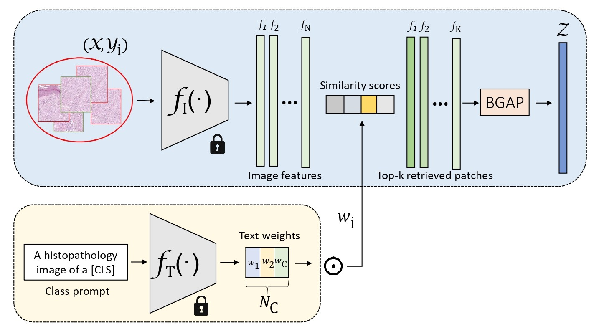

# MI-VisionShot  



### MI-VisionShot: Non-parametric few-shot adaptation of vision-language models for slide-level classification of histopathological images  
[Pablo Meseguer<sup>1</sup>](https://scholar.google.es/citations?user=4r9lgdAAAAAJ&hl=es&oi=ao), [Rocío del Amor<sup>1,2</sup>](https://scholar.google.es/citations?user=CPCZPNkAAAAJ&hl=es&oi=ao), [Valery Naranjo<sup>1,2</sup>](https://scholar.google.com/citations?user=jk4XsG0AAAAJ&hl=es&oi=ao)
<sup>1</sup>[Universitat Politècnica de València (UPV)](https://www.upv.es/), <sup>2</sup>[Artikode Intelligence S.L.](https://www.artikode.com/)

#### Setting up MICIL

* Clone MIVisionShot repository. Intall a compatible torch version with your GPU and required libraries.
```
git clone https://github.com/PabloMeseguerEsbri/MIVisionShot.git
cd MIVisionShot
pip install torch==1.12.0+cu116 torchvision==0.13.0+cu116 torchaudio==0.12.0 --extra-index-url https://download.pytorch.org/whl/cu116
pip install -r assets/requirements.txt
```

#### Usage

* Data downloading 

MIVisionShot is validated in a public dataset of WSI with a diganosis of renal cell carcinoma (RCC) downloaded from The Cancer Genoma Atlas ([TCGA](https://portal.gdc.cancer.gov/)) project. We used the original implementation of [PLIP](https://github.com/PathologyFoundation/plip) for feature extraction. However, you can access the patch-level features extracted by the PLIP image encoder at [this link](https://upvedues-my.sharepoint.com/:f:/g/personal/pabmees_upv_edu_es/Er5V_XOeIDFJgZ6JL0Beu7ABlKH9MtLwZfnGw2MJuMPB7A?e=lP6Hw8).

* Code reproducibility

To run the MI-VisionShot framework, you should indicate the folder where you just placed the downloaded data. Modify accordingly the *k_patches* and *n_shots* variables to create different configurations. Consider including your HuggingFace token to access the PLIP model. By default, the frameworks runs five (5) random few-shot samples to assess variability.

```
python main.py --folder <your_folder> --k_patches 2000 --n_shots 16 --hug_token <yout_token>
```
